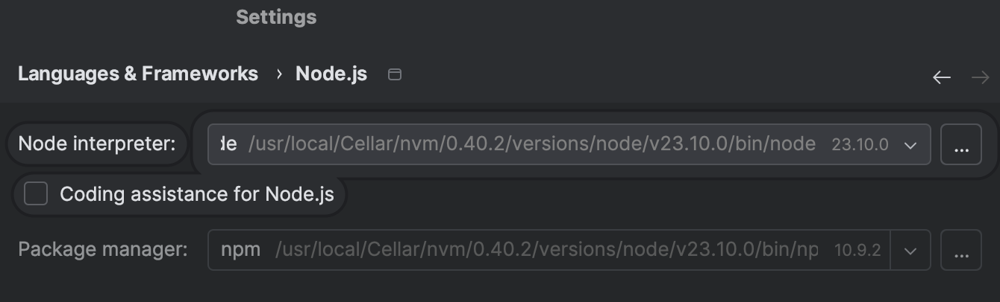
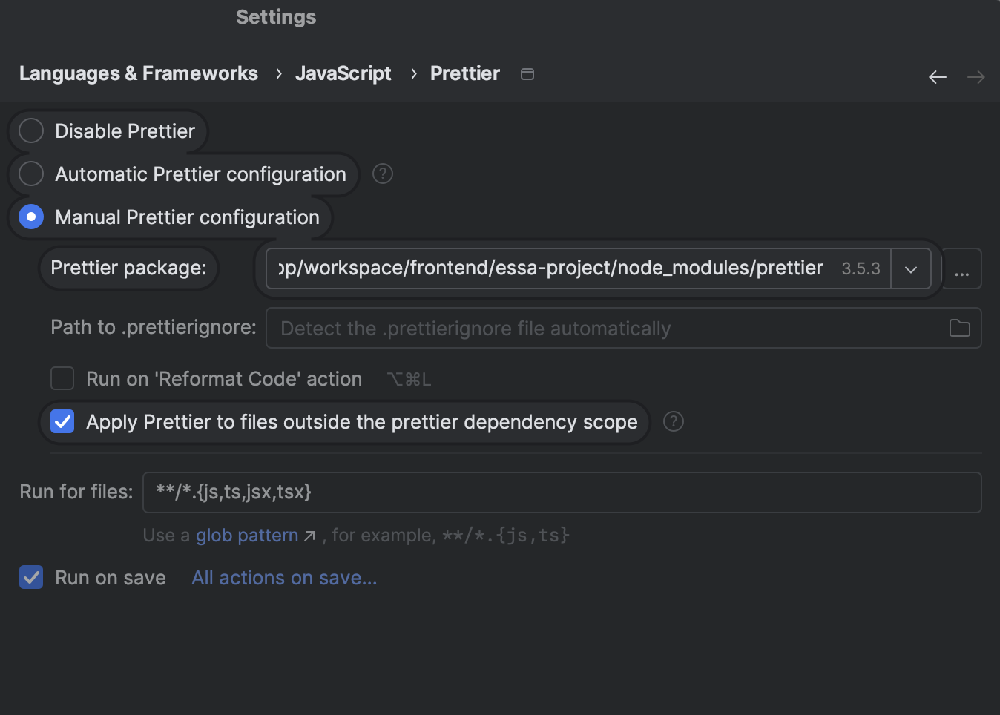
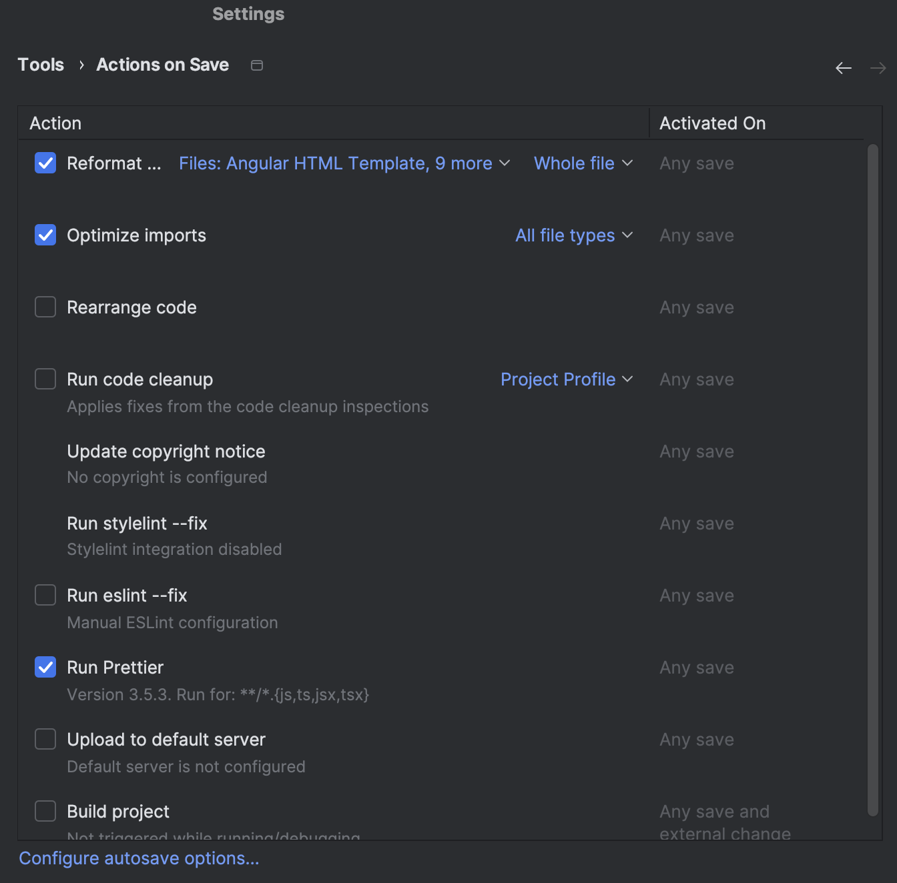

# Frontend 🌐

Application frontend service.

---

## Environment setup 💻

### Install `NVM` (Node Version Manager)

**Mac 🍎**

1. Install nvm using HomeBrew
```
brew instal mac
```
2. Create NVM directory (if not already created)

```
mkdir ~/.nvm
```

3. Add NVM to shell profile
 - For zsh:
```
echo 'export NVM_DIR="$HOME/.nvm"' >> ~/.zshrc
echo '[ -s "/opt/homebrew/opt/nvm/nvm.sh" ] && \. "/opt/homebrew/opt/nvm/nvm.sh"' >> ~/.zshrc
echo '[ -s "/opt/homebrew/opt/nvm/etc/bash_completion" ] && \. "/opt/homebrew/opt/nvm/etc/bash_completion"' >> ~/.zshrc
source ~/.zshrc
```
- For bash:
```
echo 'export NVM_DIR="$HOME/.nvm"' >> ~/.bashrc
echo '[ -s "/opt/homebrew/opt/nvm/nvm.sh" ] && \. "/opt/homebrew/opt/nvm/nvm.sh"' >> ~/.bashrc
echo '[ -s "/opt/homebrew/opt/nvm/etc/bash_completion" ] && \. "/opt/homebrew/opt/nvm/etc/bash_completion"' >> ~/.bashrc
source ~/.bashrc

```

4. Verify installation
```
nvm --version
```

5. Install and use Node.js (latest version)

```
nvm install node
```

6. To always use a specific version when opening a terminal, run the following command:

```
nvm alias default node
```

7. Restart your terminal and test
```
node -v
```

**Windows 🪟**

1. Download NVM for Windows
- Go to [nvm for Windows](https://github.com/coreybutler/nvm-windows/releases)
- Download the latest `nvm-setup.exe`

2. Run the installer and follow installation steps

3. Restart your terminal

4. Verify installation
```
nvm version
```

5. Install and use Node.js (lastest version)

```
nvm install node
```

6.  Use the downloaded version

```
nvm use node
```

7. Restart your terminal and test
```
node -v
```

### Run npm install

- Navigate to frontend/essa-project and run
```
npm install
```

- Or, if you are using IntelliJ - go to `package.json` file and right click on it → on the bottom there is an option `run npm install`.

### Run frontend application

You should now be able to run the frontend application. You can do this by:

- running the command `npm start` in the _frontend/essa-project_ directory

or

- if you are using IntelliJ, go to `package.json` and click the play button by the start script - this will then be added to your services where you will be able to run them seamlessly. 

---

## IntelliJ configuration ⚙️ (optional, but recommended)

### Node.js

Now, that you have installed node, you need to check if it is properly configured in the settings. It should look something like this:




### Prettier
Prettier is used in this project to maintain consistent code formatting across all files.

If you are using IntelliJ, you need to manually configure some settings regarding Prettier. Go to Settings → and search for `prettier`.

Configure it according to the picture below:


Then also click on the `actions on save` button and tick the following boxes. For `reformat code` action you need to only select frontend specific files (js, html, css, scss, ts, ...)




Now, your files will be automatically formatted according to Prettier rules every time you save!

You can also reformat all files with Prettier by running the `prettier:all` script from `package.json`.